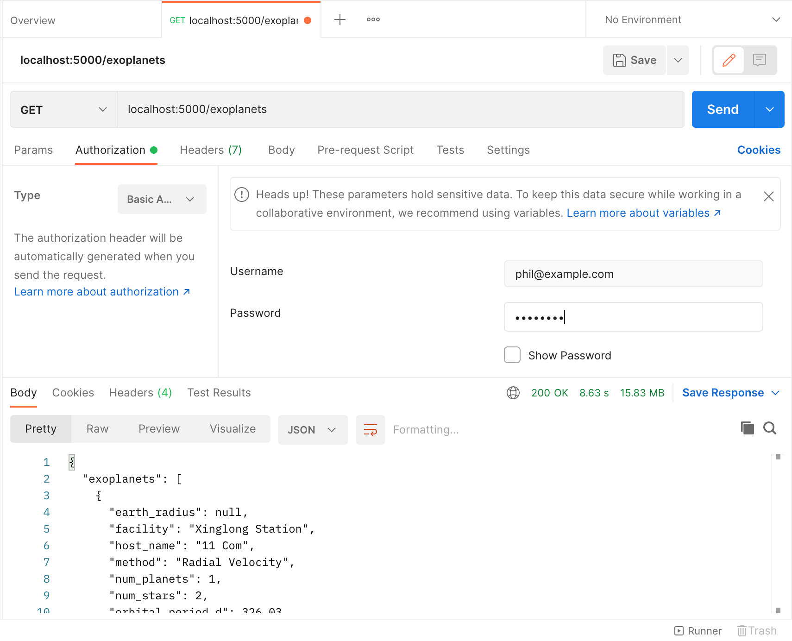

# Instructions

This will guide you on setting up the example!

## Environment Setup

In your terminal, set up environment variables:

- Mac or Linux
  ```bash
  export FLASK_APP=app.py
  export FLASK_ENV=development
  # optional
  set FLASK_DEBUG=1
  ```

- Windows
  ```powershell
  set FLASK_APP=app.py
  set FLASK_ENV=development
  # optional
  set FLASK_DEBUG=1
  ```

Then, launch a `flask shell` session:

```bash
flask shell
```

Within the session, add data to database:

```python
db.create_all() # create database tables
Exoplanet.insert_exoplanets() # add exoplanet data to database
u = User(username="phil", password="password", email="phil@example.com") # create example user
db.session.add(u) # add user to database
db.session.commit() # commit database actions
exit() # exit flask shell
```

## Launch the API!

Now you can launch the API to test it out. There is one endpoint at `localhost:5000/exoplanets` which allows GET requests for users who authenticate through basic auth.

```bash
flask run
```

## Example API Request in Postman

In Postman, you can make a new tab to make an API request. For the request URL, type `localhost:5000/exoplanets`. In the Authorization subtab, choose "Basic Auth" as type, then enter the example user's email and password.

You should see JSON showing the exoplanets in the response body (bottom).



If you get "Unauthorized Access", then you may have entered the wrong user authentication information.
